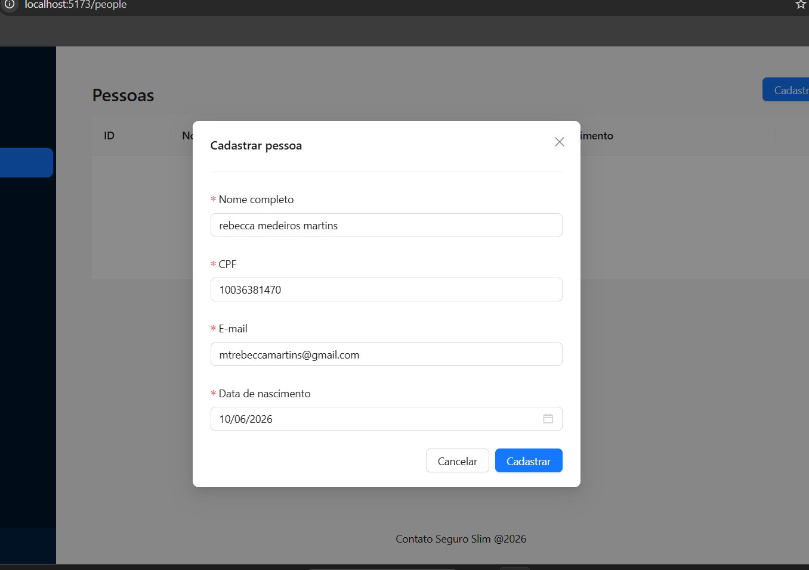
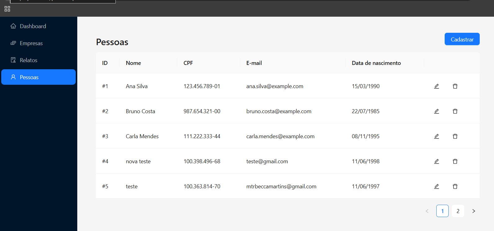
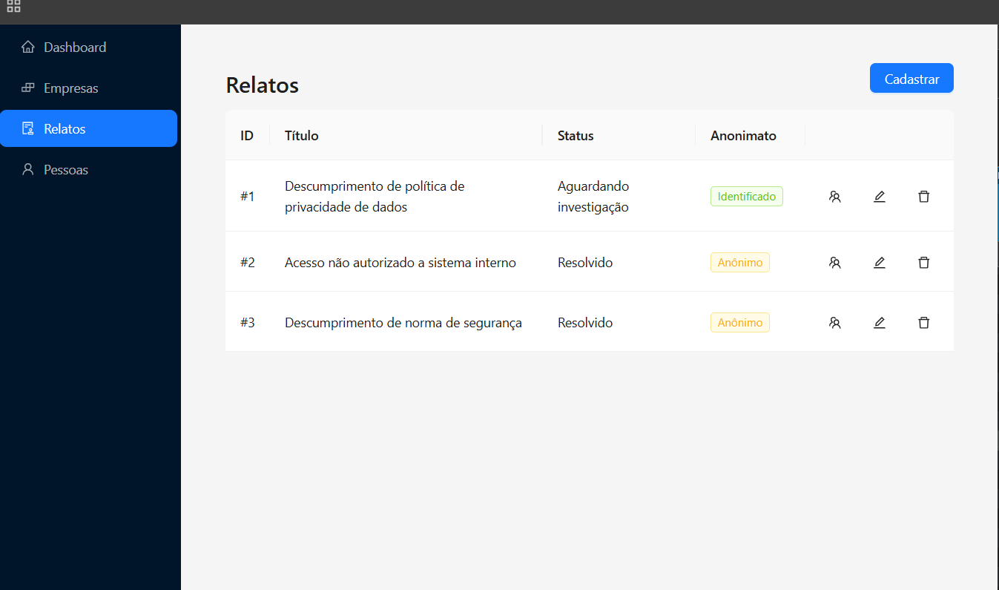
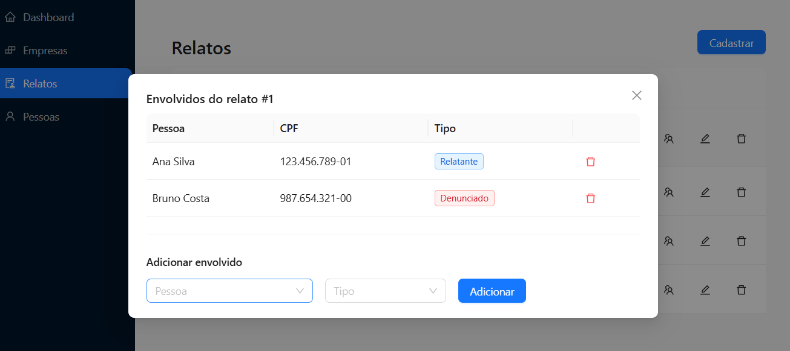
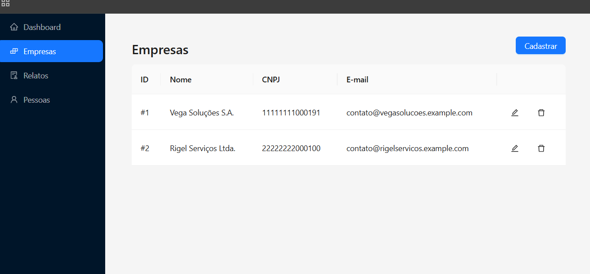
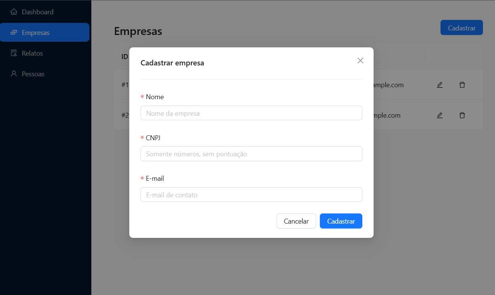

# Evidências de Testes Manuais

## Épico 1: Pessoa

### Cenário 1.1 — Cadastrar uma nova pessoa

- **O que foi testado**: Cadastro de uma pessoa com todos os campos preenchidos.
- **Passos realizados**:
  1. Acessar a página "Pessoas" pelo menu lateral.
  2. Clicar no botão "Cadastrar".
  3. Preencher: nome, CPF (11 dígitos), e-mail e data de nascimento.
  4. Clicar em "Cadastrar".
- **Resultado esperado**: Modal fecha e a pessoa aparece na tabela com CPF formatado e data em DD/MM/YYYY.
- **Resultado obtido**: Modal de cadastro abriu corretamente com todos os campos. Após preencher e confirmar, a pessoa foi cadastrada com sucesso e apareceu na listagem.
- **Evidência visual**:

### Cenário 1.2 — Consultar pessoas cadastradas

- **O que foi testado**: Listagem de todas as pessoas cadastradas no sistema.
- **Passos realizados**:
  1. Acessar a página "Pessoas" pelo menu lateral.
  2. Observar a tabela com as pessoas cadastradas.
- **Resultado esperado**: Tabela exibe todas as pessoas com ID, nome, CPF formatado, e-mail e data de nascimento.
- **Resultado obtido**: Tabela carregou corretamente exibindo todas as pessoas cadastradas com os dados formatados.
- **Evidência visual**:

---

## Épico 2: Envolvimento

### Cenário 2.1 — Consultar relatos e indicador de anonimato

- **O que foi testado**: Listagem de relatos com coluna de anonimato visível.
- **Passos realizados**:
  1. Acessar a página "Relatos" pelo menu lateral.
  2. Observar a coluna "Anonimato" na tabela.
- **Resultado esperado**: Cada relato exibe uma tag "Anônimo" ou "Identificado" conforme a presença de relatante.
- **Resultado obtido**: A tabela de relatos exibiu corretamente a coluna de anonimato com as tags visuais para cada relato.
- **Evidência visual**:

### Cenário 2.2 — Gerenciar envolvidos de um relato

- **O que foi testado**: Visualização e gerenciamento de envolvidos através do modal.
- **Passos realizados**:
  1. Acessar a página "Relatos".
  2. Clicar no ícone de envolvidos (ícone de grupo) de um relato.
  3. Observar a lista de envolvidos e o formulário para adicionar novos.
- **Resultado esperado**: Modal abre mostrando envolvidos vinculados com nome, CPF e tipo, além do formulário para adicionar novos envolvimentos.
- **Resultado obtido**: Modal de envolvidos abriu corretamente, exibindo a tabela de envolvidos e o formulário de adição com select de pessoa e tipo de envolvimento.
- **Evidência visual**:

### Cenário 2.3 — Visualizar modal de relato

- **O que foi testado**: Abertura do modal de relato.
- **Passos realizados**:
  1. Acessar a página "Relatos".
  2. Clicar no ícone de visualização de um relato.
- **Resultado esperado**: Modal abre com as informações do relato.
- **Resultado obtido**: Modal abriu corretamente com os dados do relato.
- **Evidência visual**:

---

## Funcionalidades existentes (Empresa)

### Cenário 3.1 — Consultar empresas cadastradas

- **O que foi testado**: Listagem de empresas no sistema.
- **Passos realizados**:
  1. Acessar a página "Empresas" pelo menu lateral.
  2. Observar a tabela com as empresas cadastradas.
- **Resultado esperado**: Tabela exibe empresas com ID, nome, CNPJ e e-mail.
- **Resultado obtido**: Tabela carregou corretamente com todas as empresas cadastradas.
- **Evidência visual**:

### Cenário 3.2 — Cadastrar empresa

- **O que foi testado**: Modal de cadastro de empresa.
- **Passos realizados**:
  1. Acessar a página "Empresas".
  2. Clicar em "Cadastrar".
  3. Preencher os campos.
- **Resultado esperado**: Modal abre com campos de nome, CNPJ e e-mail.
- **Resultado obtido**: Modal de cadastro abriu corretamente com todos os campos e validações.
- **Evidência visual**:

